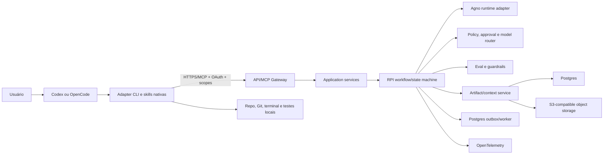

# Megas-xlr — Plano de implementação da refatoração da plataforma

**Status:** pronto para revisão e aprovação humana  
**Research de origem:** `research.md`, corte de 11 de julho de 2026  
**Baseline validada:** branch `main` antes deste documento, Agno 2.6.0, Python 3.12.13  
**Runtime-alvo confirmado:** CPython 3.14 convencional, com GIL  
**Escopo:** Foundation, vertical slice RPI, adapter local e plataforma de modelos/evals  
**Fora de escopo:** implementar código nesta fase, deploy de produção, autonomia irrestrita e
integrações com sistemas InChurch

## 1. Objetivo e resultado esperado

Transformar o scaffold Phase 0 em uma plataforma de engenharia orientada a workflows,
auditável e segura, sem reescrever os componentes úteis nem manter a premissa de um supervisor LLM
onisciente. O primeiro resultado utilizável deve receber uma solicitação real e produzir, por
referência versionada, `ResearchArtifact`, `PlanArtifact` e `ImplementationArtifact`, com execução
no repositório pelo host local, gates humanos, budgets, trace e evidência verificável.

O plano termina quando os quatro incrementos estiverem implementados e seus Definition of Done
forem satisfeitos. Cada incremento deve poder ser entregue isoladamente e preservar um caminho de
rollback.

## 2. Evidência da codebase atual

### 2.1 Baseline verificada

- Python 3.12.13, Agno 2.6.0, FastAPI 0.136.1 e Pydantic 2.13.3;
- `agentos_app.py` registra somente `megas_o` e constrói aplicação, registry e dependências no import;
- `agents/megas_o.py` fixa Gemini e mantém agente/modelo como objetos globais;
- `db.py`, `agentos_app.py`, `agents/megas_o.py` e testes carregam `.env` separadamente;
- `schemas/brief.py` e `schemas/backlog.py` são os únicos contratos de domínio existentes;
- os outros cinco módulos em `agents/` são stubs com `NotImplementedError`;
- não existem migrations, repositórios de domínio, workflow RPI, fila, auth, MCP, evals ou router;
- `make check` modifica arquivos por executar Ruff com `--fix`;
- `make clean` executa `docker compose down -v` e destrói dados;
- Ruff, formatação e mypy strict passaram;
- pytest: 5 aprovados, 2 ignorados e warning de marcador `slow` não registrado;
- os testes ignorados cobrem justamente AgentOS e chamada Gemini.

### 2.2 Prova preliminar de Python 3.14

Foi criado um ambiente temporário com CPython 3.14.4 e as 78 dependências atualmente resolvidas.
Agno, FastAPI, Pydantic, psycopg, SQLAlchemy, Google GenAI, Uvicorn e extensões nativas importaram;
JSON Schemas foram gerados; Ruff, formatação, mypy e os testes locais passaram. A conexão real com
Postgres não foi exercitada porque o container estava parado. Essa prova reduz risco, mas não
substitui o gate reprodutível descrito no Incremento 0.

## 3. Decisões confirmadas

| ID | Decisão |
|---|---|
| D-01 | Migração seletiva/estranguladora; não fazer rewrite vazio nem estender Phase 0 diretamente. |
| D-02 | Produto pessoal/single-user no MVP, com contratos preparados para multitenancy. |
| D-03 | Codex CLI/Desktop primeiro; OpenCode entra depois por adapter gerado da mesma especificação. |
| D-04 | OpenCode Go é usado apenas pelo host OpenCode no MVP; backend chama provedores diretamente. |
| D-05 | Código não sai da máquina por padrão; somente evidence packs selecionados e autorizados. |
| D-06 | Codebase Library local, com sincronização opt-in apenas de metadados e hashes por projeto. |
| D-07 | Indexação MVP: Python, TypeScript/JavaScript, SQL e Markdown/YAML/TOML; recall@5 >= 90%. |
| D-08 | Leitura e checks podem ser automáticos; mutações seguem plano aprovado; efeitos externos pedem aprovação específica. |
| D-09 | GitHub inicial: leitura, PR e CI, sem deploy automático. |
| D-10 | Identidade: GitHub OAuth/OIDC. |
| D-11 | Adapter distribuído por CLI/instalador Python, executável em poucos comandos num único terminal. |
| D-12 | Workflows de prova: bugfix, feature com migration e tratamento de feedback/CI de PR. |
| D-13 | Benchmark: JUDAH público, inchurch-knowledge privado e br-masters-v2 privado. |
| D-14 | Render é hipótese principal; spike equivalente contra Railway precede decisão final. |
| D-15 | Fila inicial em Postgres com outbox; object storage S3-compatible; OpenTelemetry. |
| D-16 | O plano cobre os quatro incrementos; Foundation e RPI recebem maior granularidade. |
| D-17 | Arquivar Phase 0, criar ADRs, versionar research, usar branch `feature/*` e corrigir comandos destrutivos. |
| D-18 | CPython 3.14 convencional é o runtime do MVP; free-threaded é benchmark posterior. |

### 3.1 Políticas provisórias autorizadas por melhores práticas

Estas políticas são defaults versionados, não compromissos comerciais imutáveis:

- evidence pack bruto no backend: zero por padrão; quando autorizado, TTL de 24 horas;
- artefatos RPI aceitos: 30 dias por padrão, configurável e removível por projeto;
- audit metadata sem código: 90 dias no MVP;
- traces com conteúdo redigido: 14 dias; métricas agregadas: 90 dias;
- logs locais e índice local seguem política do host/projeto e não são sincronizados por padrão;
- soft budget por tarefa simples: US$ 0,50; média: US$ 3; crítica: US$ 15;
- acima do soft budget, pausar e pedir aprovação; hard cap padrão igual a 2x o soft budget;
- alvo de tempo p50/p95: simples 2/5 min, média 10/25 min, crítica 30/90 min;
- disponibilidade inicial é SLI, não SLO contratual: medir 30 dias antes de fixar meta pública;
- objetivo operacional interno após estabilização: 99,5% mensal para API/control plane, excluindo
  indisponibilidade de provedores claramente atribuída e janelas anunciadas.

Todos os valores devem viver em configuração, gerar métricas e ser reavaliados após o benchmark.

## 4. Princípios e invariantes

1. O workflow/código é a autoridade sobre estado, gates, retries e transições.
2. Agno fica atrás de interfaces próprias e não entra nas entidades de domínio.
3. Todo agente possui `output_schema` Pydantic; prompts ficam em `.md`.
4. Regras determinísticas não são delegadas ao LLM.
5. O backend é policy plane e system of record; o host local executa no repositório.
6. MCP e HTTPS são adapters externos, não o modelo de domínio.
7. Nenhuma ferramenta genérica de shell remoto será exposta pelo backend.
8. Nenhum código de projeto é enviado sem policy e consentimento explícitos.
9. Toda mutação externa usa scope, approval, idempotency key e audit event.
10. Implementação, revisão e verificação são separadas proporcionalmente ao risco.
11. Memória e Codebase Library são índices derivados; source e Git são autoridade.
12. Nenhuma lógica de BR Masters, JUDAH ou InChurch entra em prompts/capabilities genéricos.
13. Integrações com HubSpot, N8N, Heimdall, Jira e Salomão permanecem proibidas.
14. Mudanças comportamentais começam por testes e terminam com `make check` não mutante.

## 5. Arquitetura-alvo



### 5.1 Fronteiras

- **Domain:** entidades, value objects, políticas e eventos sem imports de Agno/FastAPI/SQLAlchemy.
- **Application:** casos de uso, ports, transações e orquestração de domínio.
- **Infrastructure:** Postgres, object storage, OAuth, providers, queue/outbox e telemetry.
- **Runtime adapters:** Agno, HTTP/FastAPI, MCP e worker.
- **Local adapters:** CLI, installer, skills, hooks e integrações específicas de host.

### 5.2 Estrutura de diretórios pretendida

```text
megas_xlr/
  domain/
    artifacts/
    workflows/
    policies/
    approvals/
    models/
    codebase/
    events/
  application/
    ports/
    services/
    commands/
    queries/
  infrastructure/
    db/
    repositories/
    outbox/
    storage/
    identity/
    models/
    telemetry/
  runtime/
    agno/
    http/
    mcp/
    worker/
  settings.py
  bootstrap.py
agents/
  prompts/
workflows/
  prompts/
adapter_spec/
  capabilities.yaml
  skills/
  policies/
  hooks/
  mcp/
adapters/
  codex/
  opencode/
installer/
migrations/
tests/
  unit/
  integration/
  contract/
  conformance/
  evals/
docs/
  adr/
  history/
```

Os nomes finais podem variar apenas por ADR; as dependências entre camadas são obrigatórias.

## 6. Contratos de domínio

### 6.1 Envelope comum de artefato

`ArtifactEnvelope[T]` deve conter:

- `artifact_id`: UUIDv7 gerado pelo domínio;
- `artifact_type` e `schema_version`;
- `run_id`, `project_id`, `repository_id` opcionais no modo pessoal;
- `source_artifact_ids` e `supersedes_id`;
- `status`: draft, submitted, accepted, rejected, superseded;
- `created_at`, `created_by` e `content_hash`;
- `repo_snapshot`: remote, branch, commit SHA, dirty flag e hashes relevantes;
- `provenance`: modelo, provider, prompt/skill version, tool calls e evidence pointers;
- `budget`: limite e consumo de tokens, custo e tempo;
- `payload: T`.

Artefatos aceitos são imutáveis. Correções criam nova versão ligada por `supersedes_id`.

### 6.2 Artefatos mínimos

- `ResearchArtifact`: intenção, brief, implemented-versus-intended, claims, evidências, riscos,
  hipóteses, perguntas abertas, escopo provável e model recommendation;
- `PlanArtifact`: requisitos, steps atômicos, dependências, paths prováveis, contratos, migrations,
  testes, approvals, rollback, budgets e DoD;
- `ImplementationArtifact`: patches/commits, comandos, resultados, desvios, testes e pendências;
- `HandoffArtifact`: objetivo, estado, decisões, evidências, hashes, bloqueios e próximo passo;
- `ContextCheckpoint`: working set, decisões, invariantes, evidence pointers, itens descartados,
  coverage e budget;
- `ApprovalRequest/Decision`: ação, efeito, risco, scope, expiry, ator e justificativa;
- `EvalRun/Result`: fixture, candidate, rubric, determinísticos, judge, custo e resultado;
- `LocationResult` e `AnalysisArtifact` para Codebase Library.

### 6.3 Estado RPI

Estados principais:

`requested -> researching -> research_review -> planning -> plan_review -> implementing ->
verifying -> ready_for_release -> released`.

Estados laterais:

`needs_input`, `failed`, `cancelled`, `rolling_back`, `rolled_back`.

Regras:

- transições são comandos idempotentes e usam optimistic concurrency/version;
- `needs_input` preserva o estado anterior e a pergunta bloqueante;
- retry não cria transição de negócio silenciosa;
- `released` requer approval separado de implementação;
- desvio material do plano retorna a `plan_review`;
- cada transição grava ator, motivo, artefatos, policy version, custo e trace ID.

## 7. Persistência e migrations

### 7.1 Tabelas iniciais

1. `users`, `oauth_identities`;
2. `projects`, `repositories`, `project_memberships` — membership existe mesmo no single-user;
3. `runs`, `workflow_instances`, `workflow_transitions`;
4. `artifacts`, `artifact_blobs`, `artifact_links`;
5. `evidence_pointers`, sem conteúdo bruto por padrão;
6. `approval_requests`, `approval_decisions`;
7. `model_calls`, `tool_calls`, `budget_ledger`;
8. `audit_events` append-only;
9. `outbox_events`, `worker_leases`, `idempotency_keys`;
10. `eval_suites`, `eval_cases`, `eval_runs`, `eval_results`;
11. metadados sincronizáveis de `codebase_snapshots`, sem source por padrão.

### 7.2 Regras de migration

- Alembic é a autoridade; AgentOS não cria schema de domínio implicitamente em produção;
- toda migration possui teste up e, quando tecnicamente seguro, downgrade;
- migrations destrutivas usam expand/contract e approval explícito;
- backfills são jobs idempotentes separados da DDL;
- nenhuma migration externa roda no startup da API;
- Postgres local continua na porta 5433;
- o schema usado internamente pelo Agno deve ser isolado e documentado.

## 8. API HTTP e MCP

### 8.1 Recursos HTTP mínimos

- `POST /v1/runs`, `GET /v1/runs/{id}`;
- `POST /v1/runs/{id}/transitions`;
- `POST /v1/artifacts`, `GET /v1/artifacts/{id}`;
- `POST /v1/approvals/{id}/decisions`;
- `GET /v1/projects/{id}/policies`;
- `POST /v1/evals/runs`, `GET /v1/evals/runs/{id}`;
- OAuth callback/session endpoints;
- health: liveness sem dependências e readiness com dependências críticas.

### 8.2 Tools MCP de alto nível

- `research.start`, `research.submit`;
- `plan.start`, `plan.submit`;
- `implementation.start`, `implementation.report`;
- `approval.request`, `approval.status`;
- `eval.run`, `run.status`;
- `codebase.metadata.sync`, somente quando opt-in.

Todas devem possuir schemas versionados, timeout, idempotency key quando mutáveis, classificação de
side effect, scopes e erro tipado. Endpoints internos não são publicados automaticamente como tools.

## 9. Segurança, identidade e privacidade

### 9.1 GitHub OAuth/OIDC

- authorization code com PKCE para CLI/desktop;
- token Megas-xlr curto após troca server-side;
- refresh token rotacionado e revogável;
- GitHub token armazenado cifrado no servidor apenas quando integração for ativada;
- scopes mínimos e incrementais;
- CSRF/state, redirect URI allowlist e device flow apenas se o host exigir;
- autorização interna continua por user/project/repository/tool scope.

### 9.2 Scopes

`project:read`, `artifact:read`, `artifact:write`, `repo:metadata`, `github:read`, `github:pr:write`,
`ci:read`, `tool:local-write`, `external-write`, `deploy`, `secrets`.

MVP não concede `deploy`. PR e comentários usam approval por operação ou grant temporal explícito.

### 9.3 Proteções obrigatórias

- deny-by-default; egress allowlist; SSRF protection;
- secrets server-side e redaction antes de logs/traces/modelos;
- conteúdo de repo, issue e web é dado não confiável sujeito a prompt injection;
- artifact/evidence upload exige policy e consentimento exibindo paths e tamanho;
- assinatura/checksum de adapter e manifest;
- audit append-only e kill switch por provider, model, tool, project e workflow;
- política de retenção e exclusão testada end-to-end;
- threat model e abuse cases em ADR antes da exposição pública.

## 10. Model gateway e budgets

Criar port próprio `ModelGateway` com request/result neutros e adapters por provider. O domínio não
importa classes de modelo Agno. Toda chamada registra modelo exato, provider, tentativa, tokens,
cache, custo estimado, latência, erro e artifact/run.

Router inicial usa configuração versionada e score por capability, risco, tool-fit, context-fit,
disponibilidade e custo. Não hardcodear nomes em prompts. Fallback só ocorre entre modelos aprovados
para a mesma classificação de dados.

Controles:

- soft/hard budget por run e step;
- timeout, retry com jitter e limite por classe de erro;
- circuit breaker por provider/model;
- repair limitado para structured output;
- falha de schema é distinta de transporte e de reprovação por eval;
- review crítico não usa automaticamente o mesmo modelo do implementer;
- OpenCode Go permanece no host OpenCode durante o MVP.

## 11. Engenharia de contexto e Codebase Library

### 11.1 Context policy

- 0–30%: normal;
- 30–40%: alerta e evidence packs;
- 40–50%: checkpoint/handoff obrigatório;
- acima de 50%: nenhuma subtask substancial nova;
- reservar 15–20% para raciocínio, outputs inesperados e resposta final;
- FIC em fronteiras semânticas, troca de fase/modelo e após outputs volumosos.

O checkpoint valida hashes e coverage e nunca substitui requisito literal sem pointer ao original.

### 11.2 Indexador local MVP

Pipeline:

1. resolver raiz, Git snapshot, `.gitignore`, allow/deny lists e secrets policy;
2. detectar workspaces e linguagens;
3. extrair símbolos/relações com Tree-sitter; LSP/SCIP somente por adapter disponível;
4. indexar rotas, schemas, migrations, testes, configs, docs e Git;
5. persistir grafo e busca lexical localmente; embeddings são opcionais;
6. gerar summaries bottom-up e `codebase_library.md` compacto;
7. invalidar incrementalmente por diff/commit e content hash;
8. rodar conformance e coverage checks.

SQLite local é o default do índice. Neo4j fica fora do MVP. O backend recebe somente metadados e
hashes quando o projeto opta por sincronização.

### 11.3 Tools locais

`codebase.overview`, `locate`, `symbol`, `neighbors`, `flow`, `impact`, `evidence`, `refresh` e
`coverage`. Todas aceitam budget/limit e retornam truncation e coverage explícitos.

Gate de produto: recall@5 >= 90% no conjunto rotulado, sem queda de segurança ou vazamento.

## 12. Adapter CLI e instalação

### 12.1 Experiência-alvo

```text
uv tool install megas-xlr
megas-xlr auth login
megas-xlr install --host codex
megas-xlr doctor
```

O comando `install` detecta host, mostra diff, pede confirmação para paths externos, instala skills,
policies, hooks e configuração MCP, e grava manifest/checksum. Deve ser idempotente, reversível e
oferecer `update`, `status`, `doctor` e `uninstall`.

### 12.2 Especificação canônica

Codex e OpenCode são gerados de `adapter_spec/`; arquivos específicos ficam em `adapters/`. Testes
de conformance validam equivalência sem presumir APIs de hooks iguais. Nenhuma API key é embutida.

O Codex é o primeiro adapter funcional. O gerador e contratos nascem portáveis; OpenCode só entra
após o vertical slice Codex passar.

## 13. Estratégia de testes e evals

### 13.1 Pirâmide

- unitários: domínio, policies, state machine, budgets, hashing e redaction;
- property-based: transições, idempotência, serializers e grafos;
- integração: Postgres, migrations, outbox, object storage, OAuth fake, providers fake;
- contrato: HTTP, MCP, schemas versionados e errors;
- conformance: Codex/OpenCode e manifests;
- evals offline: artifacts, locator/analyzer, router e workflows;
- smoke online: um caso mínimo por provider, nunca parte invisível do verde local;
- end-to-end: três workflows de prova em repo fixture isolado.

### 13.2 Regras

- testes não dependem de API key para importar ou construir a aplicação;
- providers possuem fakes determinísticos e contract tests opt-in;
- `slow`, `integration`, `online` e `destructive` são marcadores registrados;
- `make check` não modifica arquivos;
- autofix e format write ficam em comando separado;
- teste destrutivo usa banco efêmero nomeado, nunca o volume padrão;
- cobertura é indicador, mas gates críticos exigem testes de comportamento específicos.

### 13.3 Benchmark interno

Repos:

- JUDAH público;
- inchurch-knowledge privado;
- br-masters-v2 privado.

Antes de usar casos privados, criar data policy por repo. Código privado não é enviado por padrão;
fixtures devem preferir patches minimizados, synthetic variants ou execução local. Nenhuma fixture
pode introduzir integração do Megas-xlr com sistemas InChurch.

Dataset: 30–50 tarefas estratificadas, três repetições nas probabilísticas, avaliação humana cega.
Medir pass@1, testes, regressões, scope violations, tempo, tokens/cache, custo, turnos, tool errors,
context utilization, approvals e retrabalho. Resultado gera config versionada do router.

## 14. Observabilidade

- trace correlaciona host, request, workflow, step, artifact, model e tool call;
- IDs atravessam HTTP, MCP, outbox e worker;
- spans nunca carregam source bruto por padrão;
- métricas: sucesso, pass@1, retrabalho, latência, custo concluído, tokens úteis, schema/tool errors,
  retry/fallback, context checkpoints, approvals e policy violations;
- logs estruturados com redaction testada;
- dashboards por workflow/model/version;
- alertas iniciais: outbox atrasada, budget hard cap, auth anomalies, provider circuit open e eval
  regression;
- exporter OpenTelemetry é configurável; backend final será decidido por spike entre opções
  compatíveis, considerando custo, redaction, traces distribuídos e retenção.

## 15. Plano de execução

### Incremento 0 — Compatibilidade Python 3.14 e higiene da baseline

Objetivo: tornar a baseline reprodutível e não destrutiva antes da refatoração.

1. Criar ADR de Python 3.14 e atualizar teste/CI esperado antes da configuração.
2. Alterar `requires-python` para `>=3.14,<3.15`; atualizar AGENTS, README, Docker e tool configs.
3. Regenerar `uv.lock` em ambiente limpo 3.14 e verificar wheels Windows/Linux.
4. Rodar imports, JSON Schema, Agno construction, psycopg/Postgres real e smoke provider separado.
5. Validar deferred annotations em todos os schemas e factories.
6. Tornar AgentOS importável sem credenciais nem conexão antecipada.
7. Registrar markers e separar testes offline/online.
8. Separar `check`, `format` e `fix`; tornar `clean` não destrutivo.
9. Criar comando destrutivo nomeado, com confirmação e documentação.

Gate: resolução limpa, Postgres real, checks offline completos em Windows/Linux e zero mudança causada
por `make check`. Recuo para 3.12 só com incompatibilidade central reproduzida e ADR aprovada.

### Incremento 1 — Foundation

#### 1A. Configuração e bootstrap

1. Testar settings, precedence, missing secrets e ambientes.
2. Criar `Settings` único com seções DB, auth, storage, providers, budgets e telemetry.
3. Criar factories explícitas de DB, repositories, services, Agno e FastAPI.
4. Remover `load_dotenv()` e singletons globais dos módulos de domínio/runtime.
5. Validar configuração no startup; liveness não depende de terceiros.

#### 1B. Domínio e persistência

1. Testar envelope, hashing, versionamento, invariantes e state machine.
2. Implementar schemas/entidades e ports sem imports de infraestrutura.
3. Introduzir Alembic e migrations iniciais.
4. Implementar repositories e Unit of Work.
5. Adicionar outbox/idempotency e worker com lease/recovery.

#### 1C. Segurança e observabilidade

1. Escrever threat model e ADR de dados/retention.
2. Testar scopes, denial, approval, expiry, redaction e audit.
3. Implementar GitHub OAuth/OIDC e tokens internos curtos.
4. Instrumentar API, DB, workflow, model e tool calls via OpenTelemetry.
5. Implementar budget ledger e kill switches.

#### 1D. Runtime adaptado

1. Definir ports para AgentRuntime e ModelGateway.
2. Adaptar Agno 2.x sem expor tipos Agno ao domínio.
3. Preservar Megas-o apenas como compatibilidade temporária, atrás de flag.
4. Criar ADR de saída do Agno com critérios objetivos.

Definition of Done:

- app factory sem efeitos de import;
- schema reproduzível por migrations;
- auth/scopes/audit operantes;
- outbox recupera worker interrompido sem duplicar efeito;
- traces e budgets correlacionados;
- nenhum código enviado por default;
- suite offline verde em Python 3.14 Windows/Linux.

### Incremento 2 — Vertical slice RPI

#### 2A. Research

1. Testar contrato, provenance, evidence policy e research gate.
2. Implementar `research.start/submit`, artifact versioning e review humano.
3. Implementar Research capability com prompt externo e output schema.
4. Adicionar FIC/ContextCheckpoint e drift check de Git/hash.

#### 2B. Plan

1. Testar rastreabilidade requirement -> step -> verification.
2. Implementar Planner capability e `PlanArtifact`.
3. Rejeitar plano sem rollback, approvals, budgets ou DoD proporcionais ao risco.
4. Material scope change retorna a review.

#### 2C. Implement/report/verify

1. Backend emite execution contract; não edita repo remotamente.
2. Host executa escopo aprovado e reporta patches, commands e evidence.
3. Verifier executa gates determinísticos e reviewer independente quando crítico.
4. Release permanece transição separada e não implementa deploy no MVP.

#### 2D. Três workflows de prova

- bugfix: research de causa -> plano -> patch local -> tests -> review;
- feature com migration: contrato -> expand migration -> implementação -> compat/rollback;
- feedback/CI de PR: ler GitHub -> localizar falha/comentário -> plano -> patch -> checks -> PR update
  mediante approval.

Definition of Done:

- solicitação real atravessa RPI completo por artefatos referenciados;
- pause/resume, needs_input, retry e cancellation são testados;
- nenhum publish/deploy/merge implícito;
- drift e scope deviation são detectados;
- custo, trace, approvals e evidência aparecem no resultado;
- os três workflows passam em fixtures locais.

### Incremento 3 — Adapter local MVP e Codebase Library

#### 3A. Installer/CLI Codex

1. Testar install/update/uninstall idempotentes em sandbox.
2. Implementar auth, doctor, manifest, checksum, diff e rollback.
3. Gerar skills/hooks/MCP config Codex da especificação canônica.
4. Validar poucos comandos e um único terminal em Windows e Linux.

#### 3B. Codebase Library

1. Criar gold set de localização nas quatro linguagens/configs.
2. Implementar index local incremental, provenance e invalidation.
3. Implementar Locator determinístico primeiro e Analyzer evidence-bound.
4. Adicionar metadata sync opt-in e teste de não vazamento.
5. Atingir recall@5 >= 90% ou bloquear rollout.

#### 3C. OpenCode

1. Gerar adapter OpenCode da mesma spec.
2. Implementar diferenças específicas sem alterar semântica comum.
3. Rodar conformance entre hosts.
4. Manter modelos OpenCode Go no host.

Definition of Done:

- instalação Codex completa em poucos comandos;
- update e uninstall restauram estado anterior;
- Codebase Library reduz descoberta com recall comprovado;
- sync é opt-in e não contém source;
- OpenCode passa conformance antes de ser anunciado.

### Incremento 4 — Model/eval platform e infraestrutura

1. Construir suite de 30–50 tarefas e data policies dos três repos.
2. Implementar eval runner reproduzível e avaliação humana cega.
3. Executar modelos candidatos com mesmo harness/budgets/permissões.
4. Publicar config versionada de routing, fallback e escalation.
5. Implementar regressão contínua por prompt/skill/model/workflow version.
6. Executar spike Render versus Railway com topologia equivalente.
7. Medir cold start, streaming, worker recovery, deploy durante job e custo/1.000 workflows.
8. Selecionar hosting por ADR; não fundar durabilidade em feature beta não comprovada.
9. Selecionar storage S3-compatible e backend OTel por ADR/spike.

Definition of Done:

- router deriva de resultados próprios, não leaderboard;
- regressões bloqueiam rollout;
- budgets e SLOs provisórios são recalibrados com dados;
- infraestrutura recupera job interrompido sem duplicar efeitos;
- deploy target, storage e observability têm ADR e custo medido.

## 16. Sequência de ADRs

1. ADR-001: Python 3.14 e política free-threaded;
2. ADR-002: migração seletiva e arquitetura em camadas;
3. ADR-003: Agno atrás de port e critérios de saída;
4. ADR-004: modelo de artefatos e state machine RPI;
5. ADR-005: Postgres, migrations, outbox e idempotência;
6. ADR-006: GitHub OAuth, scopes e approvals;
7. ADR-007: data classification, egress e retention;
8. ADR-008: MCP/HTTP surface e versionamento;
9. ADR-009: adapter spec, CLI e distribuição;
10. ADR-010: Codebase Library local e metadata sync opt-in;
11. ADR-011: eval methodology e model routing;
12. ADR-012: Render/Railway, storage e observability.

## 17. Rastreabilidade

| Requisito/decisão | Implementação | Verificação |
|---|---|---|
| Python 3.14 | Incremento 0 | CI Windows/Linux, imports, DB, schemas e checks |
| Single-user preparado para tenancy | Foundation schema/scopes | testes de isolamento e memberships |
| RPI determinístico | Incremento 2 | state-machine, contract e E2E tests |
| Código local por padrão | policies + adapter | egress denial e leak tests |
| Codex antes de OpenCode | Incremento 3 | installer e conformance |
| GitHub read/PR/CI sem deploy | security + workflow PR | scope/approval contract tests |
| CLI em poucos comandos | installer | fresh-machine E2E Windows/Linux |
| Três workflows | Incremento 2D | fixtures E2E |
| Codebase Library | Incremento 3B | recall@5, provenance e stale-summary tests |
| Router por eval | Incremento 4 | benchmark reproduzível e regression gates |
| Infra por spike | Incremento 4 | recovery/cost/streaming report |
| Segurança desde Foundation | Incremento 1C | threat model, authz, redaction e audit tests |

## 18. Riscos e mitigação

| Risco | Impacto | Mitigação/gate |
|---|---|---|
| Dependência falhar no Python 3.14 | bloqueia Foundation | Incremento 0; rollback apenas por ADR/evidência |
| Agno dominar domínio | lock-in e testes frágeis | ports, factories e contract tests |
| Workflow duplicar efeitos | dano externo | idempotency, outbox, leases e approvals |
| Código privado vazar | crítico | deny-default, local index, consentimento e leak tests |
| OAuth/token excessivo | acesso indevido | PKCE, scopes mínimos, rotação e audit |
| Context checkpoint perder requisito | regressão silenciosa | schema, coverage e pointers/hashes |
| Índice ficar obsoleto | decisão errada | invalidation incremental e source verification |
| Router otimizar benchmark | baixa generalização | holdout, repetição e avaliação humana cega |
| LLM aprovar seu próprio trabalho | falso verde | reviewer independente por risco |
| Render/Railway perder job | inconsistência | outbox + spike de interrupção/deploy |
| CLI sobrescrever config do usuário | perda local | diff, backup, manifest e rollback |
| Escopo crescer antes do slice | atraso | gates por incremento e capabilities mínimas |

## 19. Rollback e compatibilidade

- Megas-o Phase 0 permanece temporariamente atrás de flag até o RPI atingir DoD;
- migrations seguem expand/contract; remover coluna só após versão anterior não depender dela;
- schemas externos carregam versão e política de compatibilidade N/N-1 durante rollout;
- adapters guardam backup e manifest para rollback;
- model/router configs são versionadas e promovidas separadamente do código;
- kill switches desativam workflow, provider, model ou tool;
- falha de incremento não autoriza destruir volume ou reverter mudanças alheias;
- Phase 0 spec é movida para `docs/history/`, preservando histórico e links.

## 20. Estratégia de commits e PRs

Cada incremento usa branch `feature/*`, `fix/*` ou `chore/*`, commits Conventional Commits e PR
contra `main`. Sequência sugerida:

1. `chore(runtime): adopt python 3.14 baseline`;
2. `refactor(core): introduce settings and application factories`;
3. `feat(domain): add versioned artifacts and rpi state machine`;
4. `feat(storage): add migrations repositories and outbox`;
5. `feat(security): add github identity scopes and approvals`;
6. `feat(observability): add traces budgets and audit events`;
7. `feat(rpi): add research plan and implementation workflows`;
8. `feat(adapter): add codex installer and canonical spec`;
9. `feat(codebase): add local incremental library`;
10. `feat(adapter): add opencode conformance adapter`;
11. `feat(evals): add benchmark runner and model routing`;
12. `chore(infra): add validated deployment blueprint`.

PRs devem ser menores que os incrementos quando necessário. Cada PR referencia ADR, requirement,
test evidence, migration/rollback e DoD parcial. Push, PR e ações externas continuam dependentes de
autorização explícita na sessão de implementação.

## 21. Definition of Done global

- CPython 3.14 é reprodutível em dev, CI e container;
- aplicação inicia sem efeitos colaterais de import e sem segredo para testes offline;
- domínio não depende de Agno, FastAPI, MCP ou provider;
- artifacts e transições são versionados, auditáveis e idempotentes;
- RPI completo opera com approvals, budgets, checkpoints, drift e verification;
- três workflows de prova passam;
- Codex instala em poucos comandos; OpenCode passa conformance;
- Codebase Library local atinge recall@5 >= 90% e sync é opt-in sem source;
- GitHub OAuth e integração read/PR/CI respeitam scopes e approvals;
- nenhum deploy automático existe no MVP;
- suite interna governa router e detecta regressão;
- hosting/storage/observability são escolhidos por ADR baseado em spike;
- `make check` é não mutante; comandos destrutivos são separados e confirmados;
- README, AGENTS, ADRs, runbooks, threat model e histórico estão atualizados;
- `research.md` está versionado e cada entrega mantém rastreabilidade até este plano.

## 22. Critério de aprovação deste plano

O plano pode entrar em implementação quando o usuário aprovar explicitamente este documento. A
aprovação autoriza iniciar pelo Incremento 0 em branch própria; não autoriza push, abertura de PR,
deploy, migration externa, upload de código privado ou qualquer integração proibida pelo
`AGENTS.md`. Qualquer mudança material nas decisões D-01 a D-18 exige atualização do plano ou ADR e
nova aprovação.
