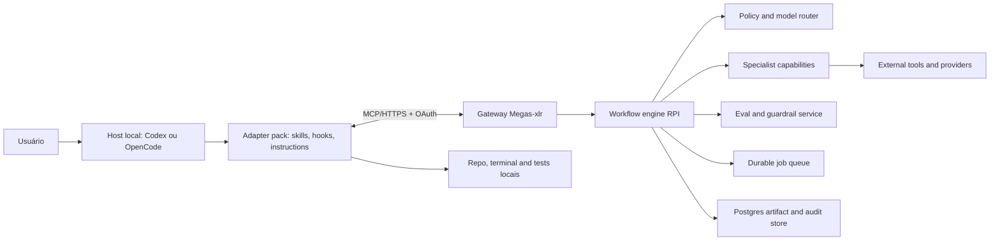

# Megas-xlr — Research para a refatoração da plataforma

**Status:** research concluído para iniciar planejamento  
**Data de corte:** 11 de julho de 2026  
**Escopo:** diagnóstico da codebase, estado da arte de sistemas de agentes, arquitetura-alvo,
engenharia de contexto, RPI, modelos e infraestrutura  
**Fora de escopo nesta etapa:** implementação, escolha final de backlog e migração de produção

## 1. Resumo executivo

O Megas-xlr atual não deve ser descartado integralmente, mas também não deve ser evoluído como se
já fosse a base de uma equipe autônoma. Ele é um **scaffold funcional de Phase 0**, com um único
agente de geração de backlog. Cinco dos seis agentes anunciados são stubs. Não existem ainda
orquestração de equipe, workflows, skills instaláveis, hooks, gateway MCP, execução durável,
avaliações, autorização, filas, política de modelos ou gestão ativa de contexto.

A recomendação é uma **substituição seletiva, com migração estranguladora**:

1. preservar os contratos Pydantic úteis, prompts externos, bootstrap do AgentOS, banco e testes;
2. remover a premissa de que um “agente orquestrador” livre deve controlar todo o ciclo;
3. criar um núcleo backend orientado a workflows determinísticos e eventos;
4. expor capacidades versionadas por MCP e HTTP, sem transferir segredos ao cliente local;
5. distribuir um adaptador local fino, composto por skills, hooks e instruções próprias de cada
   host (Codex e OpenCode inicialmente);
6. tratar o LLM local como **control plane de interação e execução no repositório**, enquanto o
   backend é o **policy plane e system of record**;
7. tornar Research → Plan → Implement um protocolo com artefatos, gates e limites de contexto —
   não apenas uma sugestão escrita no prompt;
8. usar roteamento de modelos por capacidade, risco e custo, calibrado por avaliações próprias.

O principal insight da pesquisa é que “mais agentes” não equivale a “melhor sistema”. Resultados
recentes mostram que o harness e o desenho do agente podem produzir diferenças de até 6× usando o
mesmo modelo. A arquitetura deve favorecer uma sequência curta de papéis especializados, contratos
tipados, ferramentas mínimas, checkpoints e verificação independente.

## 2. Perguntas respondidas e critérios

Esta pesquisa responde:

- o que existe hoje e o que é realmente reaproveitável;
- qual deve ser a fronteira entre backend remoto e agentes locais;
- como implementar RPI e engenharia de contexto de maneira operacional;
- como estruturar skills, hooks, ferramentas, workflows, memória, segurança e avaliações;
- quando usar cada modelo disponível;
- onde hospedar o cérebro inicialmente;
- quais hipóteses ainda exigem benchmark próprio antes de virarem regra de produto.

Critérios usados: correção, auditabilidade, isolamento entre projetos, portabilidade entre hosts,
velocidade, custo total por tarefa concluída, eficiência de contexto, segurança e capacidade de
evolução sem acoplamento a um único fornecedor.

## 3. Diagnóstico da codebase atual

### 3.1 Inventário factual

O repositório contém:

- Python 3.12, Agno 2.x, FastAPI/AgentOS, Pydantic v2 e Postgres/pgvector;
- um `AgentOS` registrado com apenas `megas_o`;
- `ProjectBrief`, `FeatureRequest`, `BacklogItem`, `OpenQuestion` e `Backlog`;
- um prompt externo para o Megas-o;
- cinco módulos que apenas lançam `NotImplementedError`;
- testes de schema, importação do AgentOS e um smoke test dependente de Gemini;
- Docker Compose local e comandos de lint, mypy e pytest;
- uma especificação antiga de Phase 0 com 1.015 linhas.

Baseline executada nesta pesquisa:

- Ruff: aprovado;
- mypy strict: aprovado;
- pytest: **5 aprovados, 2 ignorados**;
- os dois testes ignorados são justamente os que exercitariam AgentOS e o LLM;
- há um warning porque o marcador `slow` não está registrado;
- portanto, o resultado verde não comprova que o agente remoto funciona ou que produz backlog de
  qualidade; comprova apenas os contratos locais atualmente cobertos.

### 3.2 O que reaproveitar

| Elemento | Decisão | Motivo |
|---|---|---|
| Python 3.12 + Pydantic v2 | Preservar | Base adequada para contratos e validação |
| AgentOS/FastAPI | Preservar atrás de interfaces | Fornece runtime, sessões, workflows e tracing; não deve dominar o domínio |
| Schemas atuais | Evoluir e versionar | São uma boa semente, mas backlog não cobre o ciclo completo |
| Prompts em `.md` | Preservar | Facilita versionamento, avaliação e portabilidade |
| `PostgresDb` central | Preservar com configuração explícita | Evita instâncias divergentes; faltam migrations e abstrações de domínio |
| Testes de schema | Preservar | São rápidos e determinísticos |
| Smoke test | Reescrever como eval | Hoje é caro, ignorável e pouco diagnóstico |
| Docker Compose local | Preservar | Bom ambiente de desenvolvimento |
| Convenções do `AGENTS.md` | Preservar | Restrições de isolamento e qualidade são corretas |

### 3.3 O que substituir ou redesenhar

| Elemento atual | Problema | Direção |
|---|---|---|
| Megas-o gera backlog em uma chamada | Pesquisa, decisão e decomposição ficam comprimidas | Workflow RPI com artefatos e gates separados |
| Cinco “agentes” vazios | A equipe é nominal, não funcional | Papéis definidos por capability e workflow, criados só quando agregam valor |
| Modelo Gemini fixo no módulo | Acoplamento e ausência de política | Model gateway com roteamento, fallback, orçamento e telemetria |
| Objetos globais no import | Configuração e falhas ocorrem cedo | Application factory e dependency injection |
| `load_dotenv()` em múltiplos módulos | Bootstrap implícito | Settings única, validação no startup e secrets no servidor |
| Backlog como único output | Não há evidência, plano, patch, verificação ou handoff | Artifacts versionados para cada fase |
| IDs estimados pelo LLM | Instabilidade e colisões | IDs gerados deterministicamente pelo domínio |
| Soma de horas validada no schema | Derivação confiada ao LLM | Campo calculado no backend |
| Sem migrations | Banco não é reproduzível | Alembic e esquema versionado |
| Sem autenticação/autorização | Inaceitável em serviço público | Auth, tenant/project scopes, tool scopes e audit log |
| `make clean` destrói volume | Risco operacional | Separar limpeza de cache de destruição de dados com confirmação |
| Documento Phase 0 como fonte ativa | Descreve intenção antiga e contém pressupostos obsoletos | Arquivar como histórico e criar ADRs atuais |

### 3.4 Veredito

**Não refazer do zero. Refazer o núcleo de orquestração e o produto ao redor do scaffold.** A
estimativa conceitual é reaproveitar a infraestrutura mínima e os contratos, não a lógica do
produto. Aproximadamente 20–30% do código atual pode sobreviver com ajustes, mas menos de 10% das
capacidades necessárias já está implementado.

## 4. Estado da arte e conclusões práticas

### 4.1 Workflow antes de autonomia aberta

Agno 2.x oferece `Workflow`, `Step`, `Team`, condições, input schemas, persistência e tracing. Isso
favorece uma divisão explícita:

- **workflow determinístico** decide ordem, gates, timeout, retry, budgets e transições;
- **agente** resolve um problema semanticamente difícil dentro de uma etapa limitada;
- **código comum** executa regras que não devem depender de interpretação probabilística;
- **humano** aprova ações irreversíveis, ambíguas, caras ou externas.

Essa abordagem é superior a um chat livre entre seis personas porque reduz loops, duplicação de
contexto e decisões impossíveis de auditar. Teams são úteis para pesquisa paralela ou revisão
adversarial; não devem ser a unidade padrão de toda tarefa.

### 4.2 Contratos estruturados em todas as fronteiras

Cada etapa deve possuir `input_schema`, `output_schema`, versão, provenance e critérios de aceite.
Structured output não elimina erros: o sistema precisa distinguir falha de transporte, falha de
schema, conteúdo incompleto e resultado reprovado por avaliação. Reparos devem ter limite; depois
disso, ocorre fallback ou escalada humana.

### 4.3 Skills, MCP, hooks e plugins têm responsabilidades diferentes

- **Skill:** receita reutilizável, carregada sob demanda, com instruções, scripts e referências.
- **Tool:** operação estreita e tipada que lê ou muda estado.
- **MCP:** protocolo de descoberta e chamada de tools/resources/prompts entre host local e backend.
- **Hook:** interceptador determinístico de evento local ou remoto; valida, bloqueia, registra ou
  acrescenta contexto pequeno.
- **Workflow:** máquina de estados que coordena etapas, retries, gates e artefatos.
- **Plugin/adaptador:** empacota capacidades para um host específico.

Uma skill não deve esconder chamadas perigosas em texto. A mutação real pertence a uma tool com
escopo de permissão e idempotency key. Hooks não devem realizar raciocínio longo nem chamadas
dispendiosas no caminho crítico.

### 4.4 MCP é uma fronteira, não uma arquitetura completa

MCP resolve interoperabilidade, mas não substitui autenticação, autorização, tenancy, filas,
durabilidade ou modelo de domínio. O servidor deve expor poucas ferramentas de alto nível — por
exemplo, `research.start`, `plan.submit`, `implementation.report`, `eval.run` — em vez de converter
cada endpoint interno em tool pública.

### 4.5 Avaliações são parte do runtime

O produto deve medir **tarefa concluída**, não “resposta bonita”. A suíte precisa combinar:

- checks determinísticos: schema, lint, tipos, testes, segurança, diff scope;
- fixtures douradas por linguagem e classe de tarefa;
- LLM-as-judge apenas com rubrica, calibração e amostragem humana;
- comparação de modelos usando o mesmo harness, prompt, orçamento e tentativas;
- métricas online: sucesso na primeira tentativa, retrabalho, regressão, custo, tokens, latência,
  tool errors, context utilization e taxa de escalada humana.

Benchmarks públicos não bastam. O SWE-Bench Mobile encontrou diferença de até 6× para o mesmo
modelo conforme o desenho do agente. O SWE-WebDevBench encontrou gargalo de especificação,
desacoplamento frontend/backend e baixa prontidão de produção. Isso valida a prioridade de contratos,
gates e testes sobre a proliferação de personas.

## 5. Arquitetura-alvo: cérebro remoto e corpo local

### 5.1 Princípio de divisão

O “cérebro” não deve tentar editar diretamente qualquer máquina. O backend remoto é responsável por
política, memória, workflows, avaliações e ferramentas externas. O host local possui acesso ao repo,
terminal, IDE e credenciais locais permitidas. O LLM do Codex/OpenCode interpreta a intenção,
aciona o backend e executa mudanças locais sob as regras recebidas.



### 5.2 Backend recomendado

Camadas lógicas:

1. **API/MCP Gateway:** autenticação, rate limit, scopes, schema negotiation e streaming.
2. **Application services:** casos de uso sem dependência direta do Agno.
3. **Workflow engine:** RPI, checkpoints, retries, compensation e human approval.
4. **Agent runtime adapter:** Agno Agents/Teams dentro de etapas específicas.
5. **Model gateway:** OpenAI e provedores compatíveis, budgets, fallback, cache e circuit breaker.
6. **Tool registry:** tools versionadas, allowlists, side-effect class e secrets server-side.
7. **Artifact/context service:** manifests, evidence packs, research, plans, diffs e summaries.
8. **Evaluation/observability:** traces, spans, evals, custo e regressões.
9. **Persistence:** Postgres como fonte de verdade; object storage para artefatos grandes; Redis ou
   fila equivalente apenas para coordenação efêmera.

### 5.3 Adapter pack local

O instalador local deve produzir artefatos nativos de cada host, a partir de uma especificação
canônica, sem presumir que Codex e OpenCode possuam hooks idênticos.

Estrutura conceitual:

```text
adapter-spec/
  capabilities.yaml
  skills/
    rpi-research/
    rpi-plan/
    rpi-implement/
    verify-change/
  policies/
  hooks/
  mcp/
adapters/
  codex/
  opencode/
installer/
```

Requisitos:

- instalação idempotente e reversível;
- manifest com versão e checksum;
- capability negotiation por host;
- nenhum segredo do backend embutido em arquivos de skill;
- allowlist de diretórios e comandos;
- atualização com diff e rollback;
- telemetria opt-in, redigida e sem enviar código por padrão;
- testes de conformidade para garantir semântica equivalente nos dois hosts.

### 5.4 Arquitetura de agentes/capabilities

Evitar criar um agente por cargo corporativo apenas por simetria. Conjunto inicial sugerido:

- **Research capability:** coleta evidência de repo, docs e web; produz `ResearchArtifact`.
- **Product/requirements capability:** explicita objetivo, restrições e critérios de sucesso.
- **Architecture capability:** registra decisões e riscos, sem implementar.
- **Planner capability:** produz passos atômicos, dependências e plano de verificação.
- **Implementer capability:** pertence principalmente ao host local; altera apenas o escopo aprovado.
- **Reviewer capability:** revisão adversarial independente e orientada a risco.
- **Verifier capability:** executa gates determinísticos e reúne evidência.
- **Release capability:** só após autorização; nunca implícita na implementação.

O orquestrador é código/workflow. Um modelo pode ajudar a classificar e decompor, mas não deve ser a
única autoridade sobre transições.

## 6. RPI como protocolo de produto

### 6.1 Research

Entrada: intenção do usuário, project brief e referências.  
Saída: `ResearchArtifact` imutável contendo snapshot do repo, arquitetura implementada versus
pretendida, evidências com localização, docs atuais, hipóteses, riscos, perguntas abertas e budget.

Gate de saída:

- fontes citadas e classificadas;
- nenhum requisito crítico inferido silenciosamente;
- impacto e caminhos tocados conhecidos;
- escolha preliminar de modelo justificada;
- pesquisa resumida antes de entrar na zona de saturação.

### 6.2 Plan

Entrada: versão específica do research.  
Saída: `PlanArtifact` com steps pequenos, arquivos prováveis, contratos, migrations, testes,
rollback, approvals e Definition of Done.

Gate de saída:

- rastreabilidade requisito → step → verificação;
- passos independentes quando paralelizáveis;
- ações externas e destrutivas explicitamente marcadas;
- budget e limites de contexto por step;
- aprovação humana para mudança material de escopo.

### 6.3 Implement

Entrada: research + plano aprovados, ambos por referência.  
Saída: `ImplementationArtifact` com patches/commits, comandos executados, resultados, desvios,
evidência de teste e itens restantes.

Gate de saída:

- mudança restrita ao plano ou desvio formalmente registrado;
- testes proporcionais ao risco;
- revisão independente para mudanças críticas;
- nenhum publish/deploy/merge sem autorização específica.

### 6.4 Estados propostos

`requested → researching → research_review → planning → plan_review → implementing → verifying →
ready_for_release → released`, com estados laterais `needs_input`, `failed`, `cancelled` e
`rolled_back`.

Cada transição grava ator, versão de modelo, prompt/skill, tool calls, custo, timestamps, artefato de
entrada/saída e motivo.

## 7. Engenharia de contexto e a “dumb zone”

### 7.1 Posição técnica

Não foi encontrada evidência científica universal de que **50% exatos** seja um limiar onde todos os
modelos se tornem incompetentes. O fenômeno real é degradação por contexto longo, ruído, conflito,
posição da informação e menor eficiência de recuperação. O próprio GPT-5.4 cai de 93% em uma tarefa
long-context até 128K para 21,4% entre 256K–1M em outro teste do fabricante. Portanto, 50% deve ser
tratado como **limite operacional conservador**, não como lei do modelo.

### 7.2 Política recomendada

- **0–30%:** zona normal;
- **30–40%:** alerta; parar de carregar arquivos inteiros e usar evidence packs;
- **40–50%:** checkpoint obrigatório; consolidar decisões e iniciar contexto novo para a próxima
  fase ou subtask;
- **>50%:** proibido iniciar nova subtask substancial; compactar ou fazer handoff;
- reservar 15–20% para raciocínio, tool outputs inesperados e resposta final;
- limites calculados por tokens reais do modelo, não por caracteres.

### 7.3 Context packs em vez de histórico infinito

Cada step recebe apenas:

1. objetivo e Definition of Done;
2. restrições duráveis do projeto;
3. trechos de evidência necessários, com path/linhas/hash;
4. decisões anteriores relevantes;
5. interfaces e testes afetados;
6. budget e ferramentas permitidas.

Não enviar automaticamente: conversa completa, logs sem filtro, documentos já resumidos, arquivos
irrelevantes ou outputs duplicados. O sistema deve preferir recuperação híbrida (metadata + busca
lexical + embeddings quando necessário), reranking e citações. O source of truth continua sendo o
arquivo ou sistema original; memória é índice, não autoridade.

### 7.4 Handoff e compactação

Antes de 40–50%, produzir `HandoffArtifact` estruturado: objetivo, estado, decisões, evidências,
arquivos modificados, checks, bloqueios e próximo passo exato. A nova execução valida hashes para
detectar drift. Isso é superior a um resumo narrativo livre.

### 7.5 Codebase Library: inteligência estrutural do repositório

A proposta de uma biblioteca da codebase é viável e possui precedentes sólidos em **repository
maps**, code intelligence, hierarchical code summarization, graph-based retrieval e GraphRAG para
código. O Aider Repo Map, por exemplo, extrai símbolos com Tree-sitter, constrói um grafo de
dependências e usa ranking para selecionar definições relevantes dentro de um budget de tokens.
Sourcegraph usa índices de código para go-to-definition e find-references; pesquisas como CodexGraph
e Code-Craft demonstram ganhos ao combinar grafos estruturais com resumos hierárquicos.

O objetivo, entretanto, não deve ser literalmente “zerar slop”. Sempre haverá custo de indexação,
ambiguidade, código dinâmico e risco de informação desatualizada. O objetivo mensurável deve ser:

- reduzir tokens e tool calls gastos em descoberta;
- aumentar precisão de localização e cobertura cross-file;
- diminuir leitura repetida de arquivos;
- detectar reuso antes de criar abstrações paralelas;
- preservar provenance até path, símbolo, linhas, commit e hash;
- invalidar automaticamente qualquer resumo afetado por mudança no código.

#### O papel de `codebase_library.md`

`codebase_library.md` deve existir como **mapa humano e entrypoint compacto**, mas não como uma
reimplementação narrativa da codebase. A maior parte do conteúdo deve ser gerada ou validada pelo
indexador. Informações voláteis — lista completa de símbolos, relações e hashes — pertencem a um
índice consultável, não a um Markdown gigante versionado manualmente.

Conteúdo recomendado:

```text
# Codebase Library
- snapshot: <commit SHA>
- generated_at: <timestamp>
- generator_version: <version>
- coverage/status: <languages, skipped paths, parse errors>

## Sectors
### Identity and access
- responsibilities
- public entrypoints
- contracts
- owned paths
- upstream/downstream sectors
- tests and operational docs
- known invariants and risks

## Runtime flows
- request -> service -> persistence

## Cross-cutting concerns
- auth, tenancy, configuration, observability, errors

## Retrieval instructions
- stable node IDs and commands/tools for focused expansion
```

O Markdown deve apontar para IDs estáveis do índice. Um agente começa pelo mapa setorial, solicita um
subgrafo e só então lê os trechos exatos do source of truth. **O código continua sendo a autoridade; o
catálogo é um índice derivado.**

#### Modelo de dados do índice

Nós mínimos:

- repository, sector, package/module, file;
- symbol: class, function, method, type, constant;
- API route, CLI command, event, job e workflow;
- database entity/migration;
- config/env read;
- test, fixture e documentation/ADR;
- git commit/owner quando disponível.

Relações mínimas:

- contains, defines, imports, calls, implements, extends;
- reads/writes, emits/consumes, routes-to;
- tests, configured-by, documented-by, migrated-by;
- depends-on e owned-by.

Cada resultado recuperado deve carregar `path`, `start_line`, `end_line`, `symbol`, `commit_sha`,
`content_hash`, linguagem e confiança. Embeddings ajudam a traduzir intenção em candidatos, mas a
expansão final deve usar relações determinísticas de AST/LSP/SCIP, imports e references. Chunking
arbitrário por número de tokens é inadequado para código.

#### Pipeline de indexação

1. respeitar `.gitignore`, políticas de secrets e allow/deny lists;
2. detectar linguagens e workspaces;
3. extrair símbolos e relações com Tree-sitter e, quando disponível, LSP/SCIP;
4. integrar rotas, schemas, migrations, testes, configuração e histórico Git;
5. agrupar módulos em setores usando regras determinísticas primeiro e classificação assistida
   apenas onde houver ambiguidade;
6. gerar resumos bottom-up: símbolo → arquivo → módulo → setor → sistema;
7. armazenar grafo, índice lexical e embeddings opcionais localmente;
8. gerar `codebase_library.md` e um manifest de cobertura;
9. em cada diff/commit, recalcular somente nós, arestas e resumos impactados;
10. executar conformance checks para links quebrados, hashes obsoletos e setores sem cobertura.

Para o MVP, não é necessário introduzir imediatamente Neo4j. SQLite/Postgres com tabelas de nós e
arestas, busca lexical e arquivos de índice locais pode validar o produto. Um graph database só deve
ser adotado se as métricas mostrarem consultas e escala que justifiquem sua operação.

#### Codebase Locator e Codebase Analyzer

Os dois papéis são úteis, mas devem ser capabilities estreitas, não agentes oniscientes:

| Capability | Responsabilidade | Output |
|---|---|---|
| **Codebase Locator** | Traduz intenção em símbolos, arquivos, rotas, testes e subgrafos candidatos; expande dependências e referências | `LocationResult` ranqueado, barato, com provenance e motivo |
| **Codebase Analyzer** | Lê apenas o evidence pack localizado, explica fluxo/comportamento, identifica invariantes, riscos e impacto | `AnalysisArtifact` com claims ligadas a evidências e lacunas explícitas |

Fluxo: `intent → locator → focused subgraph → exact source spans → analyzer → evidence pack → RPI`.
O Analyzer não pode concluir apenas a partir de resumos; para afirmações materiais, precisa verificar
os trechos atuais. O Locator deve começar determinístico/lexical e usar um modelo barato somente para
desambiguação ou expansão semântica.

#### Progressive disclosure e tools propostas

- `codebase.overview(project, token_budget)`;
- `codebase.locate(intent, kinds, limit)`;
- `codebase.symbol(node_id)`;
- `codebase.neighbors(node_id, relations, depth, token_budget)`;
- `codebase.flow(entrypoint, direction, max_depth)`;
- `codebase.impact(changed_nodes)`;
- `codebase.evidence(node_ids, include_source, token_budget)`;
- `codebase.refresh(diff_or_commit)`;
- `codebase.coverage()`.

Toda tool precisa aceitar budget e retornar truncation/coverage explícitos. Isso impede que o próprio
mapa consuma a janela que deveria economizar.

#### Métricas para comprovar valor

- recall@k do arquivo/símbolo necessário;
- precisão das relações e do impact analysis;
- tokens e tool calls até a primeira evidência correta;
- tempo até localizar root cause;
- percentual de claims sustentadas por source spans atuais;
- taxa de summaries obsoletos detectados;
- regressões e duplicações arquiteturais comparadas ao fluxo sem library.

### 7.6 Frequent Intentional Compaction (FIC)

FIC é compatível e complementar à política anterior. Em vez de esperar o auto-compaction ou o limite
da janela, o agente **compacta deliberadamente em intervalos frequentes e fronteiras semânticas**,
preservando intenção, decisões e evidence pointers enquanto elimina observações transitórias.

FIC deve ser incorporado como mecanismo do workflow:

- após completar uma unidade de research;
- antes e depois de uma decisão arquitetural;
- ao trocar de fase RPI, modelo ou agente;
- depois de tool output volumoso;
- ao alcançar 30–40% da janela;
- antes de delegar ou retomar uma tarefa;
- sempre que o signal-to-noise ratio cair, mesmo com poucos tokens.

Cada compaction produz um `ContextCheckpoint` versionado com:

- intenção atual e Definition of Done;
- estado e próximos passos;
- decisões e respectivos motivos;
- constraints/invariantes que não podem ser perdidos;
- evidence pointers com hashes, não cópias extensas;
- arquivos/diffs e verificações;
- perguntas, riscos e incertezas;
- itens descartados e motivo da remoção;
- budget consumido e restante.

Regras de segurança contra “compactação como amnésia”:

- nenhum requisito literal ou decisão irreversível pode ser resumido sem referência ao original;
- claims críticos mantêm provenance;
- o checkpoint deve passar validação de schema e um coverage check;
- compactações são incrementais, mas periodicamente reconstruídas a partir dos artefatos canônicos
  para evitar erro acumulado;
- a próxima execução confirma o checkpoint contra hashes e estado Git;
- raw logs podem ser arquivados fora da janela para auditoria, sem continuar no contexto ativo.

Assim, os thresholds de 30/40/50% são **guardrails**, enquanto FIC é o hábito contínuo. A meta não é
encher 40% e então resumir; é manter o working set pequeno durante toda a execução.

## 8. Estratégia de modelos

### 8.1 Limitação dos benchmarks

Não existe hoje uma tabela independente e reproduzível que compare todos os modelos solicitados no
mesmo coding agent, mesmas tarefas, budgets e tool permissions. Números de fornecedores não devem ser
comparados diretamente quando harness, contexto, tentativas ou datasets diferem. Relatos comunitários
servem como hipótese, não como decisão final.

O OpenCode Go confirma disponibilidade, IDs e preços relativos. Em julho de 2026, seus preços por
milhão de tokens indicam, por exemplo: GLM-5.2 US$1,40/US$4,40; Kimi K2.7 Code
US$0,95/US$4,00; Qwen3.7 Max US$2,50/US$7,50; Qwen3.7 Plus até 256K
US$0,40/US$1,60. Os limites do plano são baseados em valor consumido, portanto “requests” não são
uma unidade estável de capacidade.

### 8.2 Roteamento inicial recomendado

| Modelo | Uso inicial | Evitar como padrão | Evidência/confiança |
|---|---|---|---|
| **GPT-5.4** | Arquitetura complexa, pesquisa crítica, planejamento, tool use difícil, revisão final e bugs de alto risco | Tarefas mecânicas em volume | Alta para capacidades OpenAI; SWE-Bench Pro 57,7%, Terminal-Bench 75,1%, Toolathlon 54,6% no harness publicado |
| **GPT-5.4 Pro** | Escalada excepcional quando o custo da falha supera muito o custo de inferência | Fluxo cotidiano | Média; alto custo e ganho dependente da tarefa |
| **GPT-5.3-Codex** | Terminal/coding quando disponível no host e demonstrar vantagem no benchmark interno | Ser chamado por hábito se GPT-5.4 resolver com menos turnos | Alta para Terminal-Bench publicado (77,3%); GPT-5.4 unificou a linha principal |
| **GPT-5.2** | Fallback OpenAI mais barato, classificação, síntese e tarefas moderadas | Decisões mais difíceis de arquitetura/tool use | Alta; preço oficial menor e baseline comparável |
| **GLM-5.2** | Planejamento/review de código longo e segunda opinião forte no OpenCode Go | Rotinas baratas ou contexto sem controle | Média; fornecedor reporta liderança open-source, mas precisa de eval própria; custo Go relativamente alto |
| **Kimi K2.7 Code** | Implementação rápida, patch focado, exploração e tarefas coding de médio risco | Arquitetura final sem revisão | Baixa–média; bom custo/latência em teste comunitário único, não benchmark universal |
| **Qwen3.7 Max** | Análise geral, planejamento e revisão alternativa | Execução em massa quando Plus satisfaz | Baixa–média; preço Go alto e evidência comparável limitada |
| **Qwen3.7 Plus** | Extração, classificação, documentação, transformação e implementações simples/longas de baixo risco | Bugs críticos ou decisões irreversíveis sem reviewer forte | Média para custo; excelente relação de preço no Go, qualidade a validar internamente |
| **DeepSeek V4 Pro** | Implementação e debugging de custo moderado, reviewer secundário, tarefas com contexto grande | Única autoridade para arquitetura/release | Média; provider confirma 1M context e interfaces; benchmark de engenharia comparável ainda limitado |

### 8.3 Política de roteamento

Usar score composto, não lista fixa:

`route = capacidade × confiança × risco × tool-fit × context-fit × disponibilidade ÷ custo esperado`

Regras iniciais:

- research/architecture de alto risco: GPT-5.4; GLM-5.2 como challenger;
- plan de médio risco: GLM-5.2 ou Qwen3.7 Max, revisado por GPT-5.4 em amostra/criticidade;
- implementação focada: Kimi K2.7 Code ou DeepSeek V4 Pro;
- tarefas mecânicas e síntese: Qwen3.7 Plus ou GPT-5.2;
- revisão não deve usar automaticamente o mesmo modelo que implementou;
- escalar por falha de eval, não por preferência subjetiva;
- nunca usar janela grande como licença para carregar o repo inteiro.

### 8.4 Benchmark interno obrigatório

Antes de cristalizar o router, executar 30–50 tarefas representativas, estratificadas em:

- bug localizado;
- bug cross-layer;
- feature com migration;
- refactor sem mudança de comportamento;
- pesquisa de docs/API;
- planejamento arquitetural;
- code review/security;
- tool use e recuperação de falha.

Medir: pass@1, testes aprovados, regressões, violações de escopo, tempo, tokens input/output/cache,
custo, turnos, tool errors e avaliação humana cega. Repetir pelo menos três vezes em tarefas
probabilísticas. O resultado deve virar configuração versionada, não prompt hardcoded.

## 9. Infraestrutura e hospedagem

### 9.1 Recomendação para a primeira produção

Entre Railway e Render, a recomendação inicial é **Render**, desde que Workflows beta não seja
assumido como fundação durável sem prova de carga. A documentação atual separa web service,
background worker, cron, Postgres e Key Value, e oferece Blueprints declarativos. Isso encaixa bem
em API + worker + banco + fila e reduz trabalho operacional.

Topologia inicial:

- Render Web Service: API/MCP stateless;
- Render Background Worker: jobs longos;
- Render Postgres: artifacts, audit, state e outbox;
- Render Key Value ou fila baseada em Postgres: dispatch/locks/cache;
- object storage externo compatível com S3: artifacts grandes;
- OpenTelemetry + backend de observabilidade independente;
- secrets no provedor, nunca no adapter pack.

Render Workflows está em beta; usar apenas após um spike demonstrar retries, idempotência,
cancelamento, observabilidade e portabilidade. Para máxima durabilidade e menor lock-in no futuro,
avaliar Temporal após comprovar necessidade. Kubernetes agora seria complexidade prematura.

Railway continua uma boa alternativa para protótipo rápido, especialmente se a equipe já dominar o
produto. A decisão final deve vir de um spike equivalente com cold start, streaming, deploy sem perda
de job, custo por 1.000 workflows e recuperação de worker interrompido.

### 9.2 Condições para reavaliar

Migrar ou adicionar infraestrutura quando houver:

- jobs de muitas horas com recovery rigoroso;
- necessidade de múltiplas regiões ou requisitos de residência;
- filas intensas e alto paralelismo;
- SLO formal e HA;
- isolamento por tenant;
- custo sustentado que justifique ECS/Fargate, Cloud Run + managed queue, Fly Machines ou Kubernetes.

## 10. Segurança e governança

Modelo mínimo:

- OAuth/OIDC e tokens curtos para adapters;
- tenant, project e repository scopes;
- tool scopes separados para read, write, external-write, deploy e secrets;
- deny-by-default e aprovação para efeitos externos;
- idempotency keys e outbox para mutações;
- egress allowlist e proteção contra SSRF;
- redaction antes de traces e prompts;
- prompt injection tratada como dado não confiável, inclusive em README, issue e web;
- sandbox local continua sob controle do host;
- audit log append-only de chamadas, approvals e mudanças de política;
- versionamento e assinatura de skills/adapters;
- retenção configurável e exclusão por projeto;
- kill switch por modelo, tool, tenant e workflow.

O backend nunca deve receber todo o repositório por padrão. A skill solicita trechos/evidence packs;
o usuário pode optar por upload ampliado com política explícita.

## 11. Observabilidade e economia de tokens

Cada run deve possuir um trace correlacionando host local, workflow, agent step, model call, tool call
e artifact. Métricas essenciais:

- sucesso e retrabalho por tipo de tarefa/modelo;
- tokens totais e tokens úteis por artefato aceito;
- cache hit de prompts/evidências;
- contexto utilizado e ponto de compactação;
- latência por etapa e tempo humano de espera;
- custo por tarefa concluída, não por chamada;
- falhas de schema/tool/retry/fallback;
- violações de scope e approvals;
- regressão de eval por versão de skill, prompt, modelo e workflow.

Otimizações recomendadas:

- prompt prefix estável para aproveitar cache;
- skills carregadas sob demanda;
- evidence packs pequenos, deduplicados e endereçados por hash;
- outputs estruturados curtos;
- sumarização incremental apenas ao cruzar thresholds;
- modelos baratos para classificação e extração;
- paralelismo apenas para subtarefas independentes;
- early exit quando gates determinísticos já reprovam.

## 12. Anti-patterns a evitar

- seis agentes conversando livremente sobre toda tarefa;
- um “supervisor” LLM como única máquina de estados;
- memória vetorial contendo tudo e sendo tratada como verdade;
- passar o histórico completo a cada etapa;
- endpoint/tool genérico de shell remoto;
- skills que acumulam centenas de regras sempre carregadas;
- LLM julgando sozinho sua própria implementação;
- escolher modelo apenas por leaderboard do fornecedor;
- esconder ações externas dentro de hooks;
- acoplar domínio de BR Masters ou outro projeto aos prompts dos agentes;
- hospedar banco ou fila no filesystem efêmero;
- afirmar autonomia total antes de medir taxa de regressão e escalada.

## 13. Decisões recomendadas para o planejamento

1. Adotar migração seletiva, não rewrite vazio nem extensão direta da Phase 0.
2. Manter Agno como runtime adaptado, sujeito a uma interface própria e ADR de saída.
3. Implementar workflow RPI determinístico como espinha dorsal.
4. Backend remoto como policy/system-of-record; host local como executor no repo.
5. MCP + HTTPS como interfaces externas; domínio interno não depende de MCP.
6. Postgres como fonte de verdade e artifacts versionados para handoff.
7. Adapter canônico gerando pacotes Codex e OpenCode, com conformance tests.
8. Limite operacional de contexto com checkpoint obrigatório entre 40–50%.
9. Model router baseado em eval própria; GPT-5.4 como referência de alta criticidade.
10. Render como hipótese principal de MVP, validada por spike contra Railway.
11. Segurança, evals, tracing e custo entram na primeira fundação, não em fase posterior.
12. Começar com poucos capabilities e criar novos agentes apenas mediante ganho medido.
13. Criar Codebase Library local-first, incremental e derivada do source, com Locator e Analyzer.
14. Adotar FIC com `ContextCheckpoint` em fronteiras semânticas e antes da saturação da janela.

## 14. Questões que o planning deve fechar

- O produto é exclusivamente pessoal no início ou já nasce multiusuário/multitenant?
- Quais ações externas podem ser automáticas e quais sempre exigem aprovação?
- O código pode sair da máquina local? Em quais projetos e sob qual retenção?
- O backend chamará modelos OpenCode Go diretamente ou estes serão usados apenas pelo host local?
- Qual é o orçamento mensal e o SLO de tempo por classe de tarefa?
- Quais são os primeiros três workflows que comprovam valor além do RPI genérico?
- Quais hosts entram no MVP: Codex CLI/Desktop, OpenCode CLI, ambos?
- GitHub/GitLab será uma integração read-only inicial ou incluirá PR/CI/deploy?
- Qual provedor de identidade e qual estratégia de distribuição/atualização dos adapters?
- Quais repositórios formam o benchmark interno inicial e quais dados não podem ser enviados?
- Quais linguagens precisam de indexação semântica no MVP e qual recall mínimo será aceito?
- O índice da Codebase Library permanece exclusivamente local ou metadados poderão ser sincronizados?

## 15. Próxima etapa proposta

Produzir `plan.md` em quatro incrementos, cada um com ADRs e Definition of Done:

1. **Foundation:** domínio, artifacts, settings, migrations, observabilidade e segurança mínima.
2. **RPI vertical slice:** um workflow completo, sem equipe ornamental.
3. **Local adapter MVP:** Codex primeiro, OpenCode em seguida com conformance tests.
4. **Model/eval platform:** benchmark interno, router e rollout progressivo.

O primeiro slice deve transformar uma solicitação real em `ResearchArtifact`, `PlanArtifact` e
`ImplementationArtifact`, executando localmente, com trace, budget e aprovação. Só depois devem ser
adicionados novos papéis, ferramentas externas ou autonomia.

## 16. Fontes principais

### Documentação oficial e primária

- [Agno documentation — Agents, Teams, Workflows e AgentOS](https://github.com/agno-agi/docs)
- [OpenAI — Introducing GPT-5.4](https://openai.com/index/introducing-gpt-5-4/)
- [OpenAI — Codex](https://openai.com/codex/)
- [OpenAI — Plugins in Codex](https://help.openai.com/en/articles/20001256-plugins-in-codex/)
- [OpenAI — A practical guide to building agents](https://cdn.openai.com/business-guides-and-resources/a-practical-guide-to-building-agents.pdf)
- [OpenCode Go — modelos, limites e preços](https://dev.opencode.ai/go)
- [Z.ai — GLM-5.2](https://z.ai/blog/glm-5.2)
- [DeepSeek — V4 Preview](https://api-docs.deepseek.com/news/news260424/)
- [Render — service types](https://render.com/docs/service-types)
- [Render — background workers](https://render.com/docs/background-workers)
- [Render — pricing](https://render.com/pricing)

### Pesquisa e benchmarks independentes

- [SWE-Bench Mobile](https://arxiv.org/abs/2602.09540)
- [SWE-WebDevBench](https://arxiv.org/abs/2605.04637)
- [Dialogue SWE-Bench](https://arxiv.org/abs/2606.13995)
- [Code-Craft — Hierarchical Graph-Based Code Summarization](https://arxiv.org/abs/2504.08975)
- [CodexGraph — Code Graph Databases for Repository-Level Tasks](https://arxiv.org/abs/2408.03910)

### Codebase intelligence e context engineering

- [Aider — Repository map](https://aider.chat/docs/repomap.html)
- [Sourcegraph — MCP e precise code intelligence](https://sourcegraph.com/mcp)
- [Frequent Intentional Compaction](https://deepwiki.com/humanlayer/advanced-context-engineering-for-coding-agents/4.2-frequent-intentional-compaction-%28fic%29)

### Evidência exploratória, não usada como verdade definitiva

- [Comparing OpenCode Go models for a real-world task — June 2026](https://number1.co.za/comparing-opencode-go-models-for-a-real-world-task-june-2026/)

> Nota metodológica: páginas de fornecedor sustentam disponibilidade, preço e resultados no harness
> declarado pelo próprio fornecedor. Comparações finais de qualidade do Megas-xlr dependem do
> benchmark interno descrito na seção 8.4.
